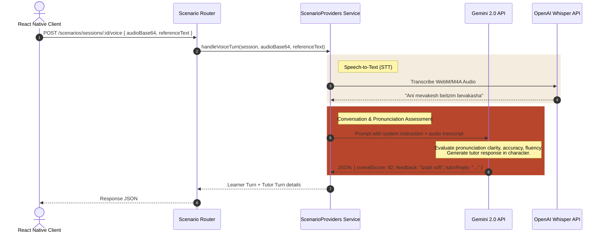

# Daber Backend — Architecture & System Integration Walkthrough

This document provides a comprehensive walkthrough of the **Daber Backend** architecture, explaining how the different modules, middleware, database, and third-party AI provider systems coordinate with each other to deliver a voice-first Hebrew learning application.

---

## 1. Architectural Blueprint (System Overview)

Daber is built as an **Express.js API service** written in TypeScript. It integrates with **Firebase Firestore** for database persistence and relies on **Google Gemini** and **OpenAI APIs** to drive generative Hebrew conversations and assess pronunciation.

```mermaid
graph TD
    Client[React Native Client] <--> Router[Express App Router]
    
    subgraph Middleware Layer
        Router --> AuthM[authenticateFirebaseUser]
        Router --> ErrM[errorHandler]
    end
    
    subgraph Routing Controllers
        AuthM --> AuthR[/auth routes]
        AuthM --> ScenR[/scenarios routes]
        AuthM --> OnbR[/onboarding routes]
    end
    
    subgraph Domain & Services
        AuthR <--> JWT[Custom JWT Helper]
        AuthR <--> Profile[UserProfile Manager]
        ScenR <--> Catalog[ScenarioCatalog]
        ScenR <--> AI[ScenarioProviders Gemini/OpenAI]
    end
    
    subgraph Data & Third-Party APIs
        Profile <--> DB[(Firestore DB)]
        Catalog <--> DB
        AI <--> Gemini[Google Gemini API]
        AI <--> OpenAI[OpenAI API Whisper / GPT]
    end
```

---

## 2. Component Walkthrough & Implementation Details

### A. Entry Point & Routing Structure (`server.ts`)
The server initializes the Express application, registers third-party middleware (`cors`, `express.json()`), defines routing paths, and configures automated Swagger OpenAPI docs:
*   **`/auth`**: Coordinates profile syncing, custom session token generation, token refresh, and profiles loading (`routes/auth.ts`).
*   **`/onboarding`**: Stores choices like target learning level, native language, learning goals, and voice selections (`routes/onboarding.ts`).
*   **`/scenarios`**: Lists available lesson themes, launches learning sessions, and processes written/spoken Hebrew turns (`routes/scenarios.ts`).

### B. Configuration System (`config.ts`)
Uses `dotenv` to load environment configurations, ensuring fallback values are defined for clean local setups:
*   Imports private credentials for **Firebase Admin** connection.
*   Resolves fallback provider preferences (`SCENARIO_PROVIDER_DEFAULT` -> gemini or openai).
*   Manages custom JWT secrets (`JWT_ACCESS_SECRET` and `JWT_REFRESH_SECRET`) and AI models.

### C. Custom JWT Session Engine (`jwt.ts` & `authenticateFirebaseUser.ts`)
To optimize performance and avoid calling Firebase verification on every single request, Daber implements a custom access/refresh token rotation system:
1.  **Exchanging**: When logging in, the client sends a Firebase ID token once to `/auth/sync-user`. The backend verifies it and replies with a custom JWT `accessToken` (valid for 15 mins) and `refreshToken` (valid for 30 days).
2.  **Verifying**: The `authenticateFirebaseUser` middleware intercepts protected requests, extracts the custom access token, verifies its cryptographic signature using native Node `crypto` HMAC-SHA256, and decodes the user payload as `req.firebaseUser`.
3.  **Refreshing**: If the access token has expired, the client sends the refresh token to `/auth/refresh`, which decodes the token, loads the user's latest Firestore fields, and rotates both tokens for continued sessions.

---

## 3. Generative Scenario & Pronunciation Engine (`scenarioProviders.ts`)

The generative AI module is the heart of Daber. It coordinates conversations, Speech-to-Text transcription, and pronunciation quality scoring.



### I. Speech-to-Text (STT)
When a user submits a spoken audio file (Base64 WebM/M4A), Daber transcribes it:
*   If using **OpenAI**, it writes the binary buffer into a temp file and streams it to the OpenAI Audio Transcriptions API (Whisper model).
*   If using **Gemini**, it utilizes Gemini's native audio processing capabilities.

### II. AI Pronunciation Assessment & Conversation
Daber uses advanced LLMs to evaluate the learner's Hebrew pronunciation dynamically:
*   The prompt feeds the AI with the **expected reference text**, the **learner's spoken transcript**, and the scene's context.
*   The system instructs the AI to assess the pronunciation across three axes:
    1.  **Accuracy Score** (1-100): Matches phonetic alignment.
    2.  **Fluency Score** (1-100): Tempo and clarity of syllables.
    3.  **Overall Score** (1-100): Average score, reflecting how natural it sounds.
*   The AI yields a structured JSON output containing the scores, actionable feedback (e.g. highlights like `TZADI: soft tz`), and Dana's next conversational reply in Hebrew.

---

## 4. Firestore Database Schema Mapping

Daber manages collections dynamically inside Firebase Firestore:

### `users` collection
Contains student records, target preferences, and milestone states:
```typescript
{
  uid: string;
  email: string | null;
  displayName: string | null;
  photoURL: string | null;
  createdAt: Timestamp;
  updatedAt: Timestamp;
  onboardingCompleted: boolean;
  onboarding?: {
    native: string; // e.g. "English"
    level: string;  // e.g. "A2"
    goal: string;   // e.g. "travel"
    voice: string;  // e.g. "dana"
  }
}
```

### `scenarioSessions` collection
Contains the active and completed conversation roleplays:
```typescript
{
  id: string; // sessionId
  uid: string; // owner uid
  themeId: string; // e.g. "supermarket"
  provider: "gemini" | "openai";
  tutorVoice: {
    id: string;
    name: string;
  };
  variation: {
    id: string;
    label: string;
    situation: string;
  };
  turns: Array<{
    role: "learner" | "tutor";
    text: string;
    createdAt: string;
    inputMode?: "voice" | "text";
    pronunciation?: {
      overallScore: number;
      accuracyScore: number;
      fluencyScore: number;
      feedback: string;
      scoringMode: "audio" | "transcript";
    }
  }>;
  createdAt: Timestamp;
  updatedAt: Timestamp;
}
```
